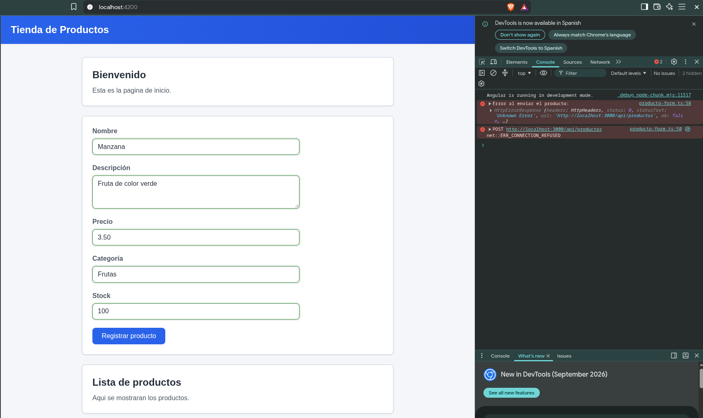

Actividad 2 de Taller

Para levantar el servidor de desarrollo, ejecuta:

```bash
ng serve
```

Luego abre `http://localhost:4200/` en el navegador.

## Campos del formulario y modelo de datos

Se definió el modelo `Producto` con los campos: nombre, descripción, precio,
categoría y stock, representando la información esencial de un producto.

```typescript
export interface Producto {
  nombre: string;
  descripcion: string;
  precio: number;
  categoria: string;
  stock: number;
}
```

El formulario se construyó con Reactive Forms, usando `FormBuilder` para
definir un `FormGroup` con un `FormControl` por cada campo del modelo.

## Validaciones configuradas

- **nombre**: obligatorio, mínimo 3 caracteres
- **descripcion**: obligatorio, mínimo 10 caracteres
- **precio**: obligatorio, mayor a 0
- **categoria**: obligatorio
- **stock**: obligatorio, no negativo

## Mensajes de error y retroalimentación visual

Se usó `*ngIf` para mostrar cada mensaje de error solo cuando el campo es
inválido y ha sido tocado (o se intentó enviar el formulario), evitando
mostrar errores antes de que el usuario interactúe:

```html
<div class="error" *ngIf="f['nombre'].invalid && (f['nombre'].touched || enviado)">
  <p *ngIf="f['nombre'].errors?.['required']">El nombre es obligatorio.</p>
  <p *ngIf="f['nombre'].errors?.['minlength']">El nombre debe tener al menos 3 caracteres.</p>
</div>
```

Los campos inválidos se resaltan con borde rojo y los válidos con borde
verde, usando las clases automáticas que Angular agrega a cada control
según su estado (`ng-invalid`, `ng-valid`, `ng-touched`).

## Integración con el servicio

El componente `ProductoForm` inyecta `ProductoService` por su constructor
(inyección de dependencias), sin instanciarlo manualmente:

```typescript
constructor(
  private fb: FormBuilder,
  private productoService: ProductoService
) {}
```

Al enviar el formulario válido, se llama a `productoService.registrarProducto()`,
que hace una petición `POST` hacia la API definida en `environment.apiUrl`
(`http://localhost:3000/api/productos`). Antes de llamar al servicio, se
valida que el formulario sea válido; si no lo es, se ejecuta
`markAllAsTouched()` para mostrar todos los errores pendientes al usuario.

## Capturas del navergador 



## Pruebas realizadas

### 1. Envío con formulario vacío
Al presionar "Registrar producto" sin llenar ningún campo, se marcaron todos
los controles como `touched` y se mostraron los mensajes de error
correspondientes a cada campo obligatorio ("El nombre es obligatorio.",
"La descripción es obligatoria.", etc.), sin realizar ninguna petición al
servicio.

### 2. Envío con datos inválidos
Se probaron valores que no cumplen las validaciones (por ejemplo, nombre de
menos de 3 caracteres, precio negativo), confirmando que cada campo muestra
el mensaje de error específico según la validación que falló, y que el
formulario no permite el envío mientras siga inválido.

### 3. Envío con datos válidos
Se llenó el formulario completo con datos correctos (Nombre: "Pepe",
Descripción: "fgdffferffdg", Precio: 10, Categoría: "tretret", Stock: 1).
El formulario se marcó como válido (todos los campos en verde) y se ejecutó
`onSubmit()`, el cual invocó `productoService.registrarProducto()`.

En la consola del navegador se confirmó que la petición `POST` se generó
correctamente hacia `http://localhost:3000/api/productos`, con el objeto
`Producto` completo y con el formato esperado. La petición retornó
`ERR_CONNECTION_REFUSED`, ya que actualmente no existe un backend real
desplegado en ese puerto. Este resultado confirma que el flujo de
validación, construcción del objeto y comunicación con el servicio
funciona correctamente hasta el punto de conexión con el servidor, cumpliendo
con el envío de datos únicamente cuando el formulario es válido.